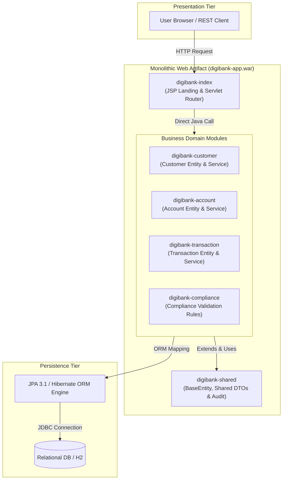
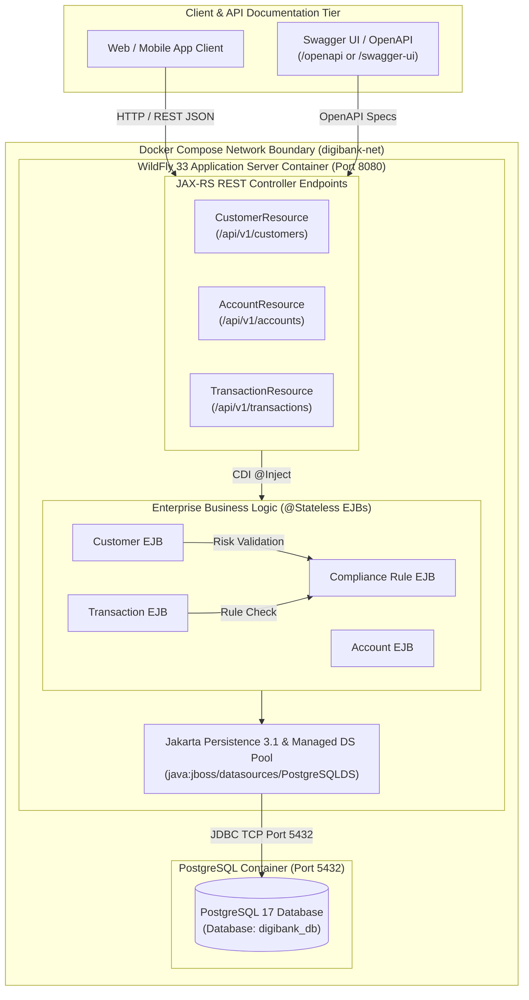
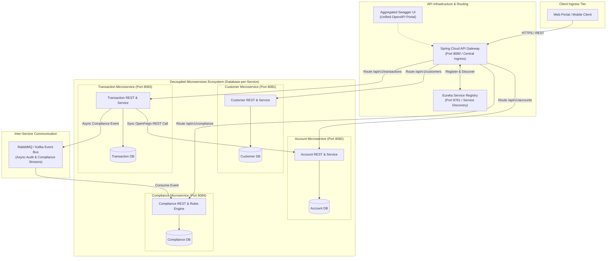

# Cloud Architecture Overview (Labs 1, 2 & 3)

This document details the architectural evolution of the **DigiBank Banking Platform** across three distinct evolutionary stages:
1. **Lab 1**: Domain-Driven Monolith (Maven Multi-Module Assembly)
2. **Lab 2**: Enterprise EE Containerized Monolith (WildFly 33 & PostgreSQL in Docker)
3. **Lab 3**: Cloud-Native Microservices Ecosystem (Spring Boot, Spring Cloud, Eureka & Docker)

---

## Lab 1: Domain-Driven Monolith Architecture (Maven Reactor)

---

## Lab 2: Enterprise EE Containerized Monolith Architecture

---

## Lab 3: Cloud-Native Microservices Architecture

