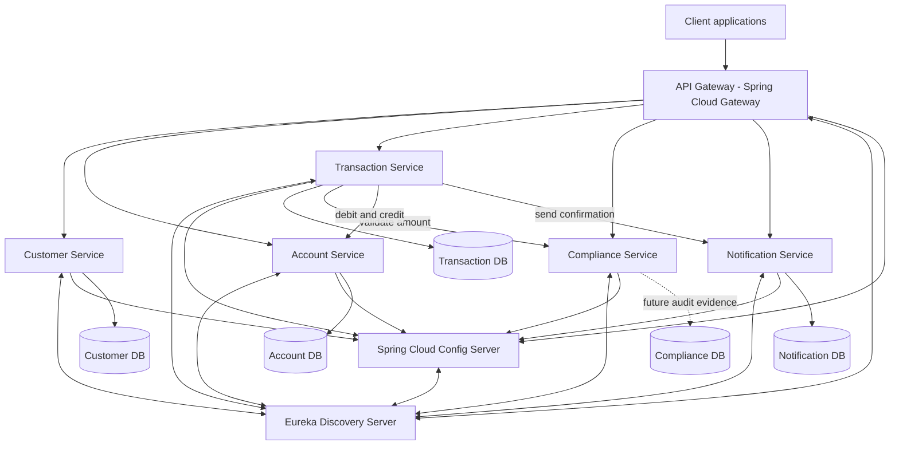
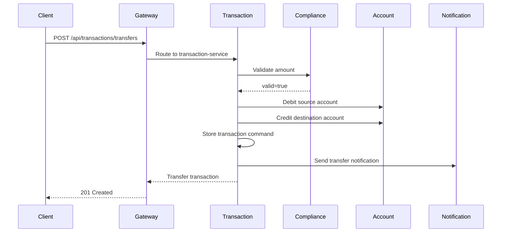

# Digi Bank - Lab 4 Microservices Architecture

> UCC 122-1 - Cloud Architecture - Lab 4<br>
> Designing a microservices architecture for Digi Bank with Spring Boot<br>
> Professional Bachelor's Degree in Cloud Computing - University of the Mountains<br>
> Supervisor: Eng. Willy Damtchou - June 2026

## 1. Objective

Lab 4 transforms Digi Bank from a single deployable application into a set of autonomous Spring Boot services. The goal is to demonstrate microservice boundaries, independent persistence, gateway routing, service discovery, centralized configuration, resilience, Saga coordination, CQRS separation, Docker orchestration, CI automation, and testable business behavior.

The existing Lab 2 Jakarta EE/WildFly application remains unchanged. Lab 4 lives in `digibank-microservices/` so both architectural stages can be reviewed independently.

## 2. Service Breakdown

| Component | Port | Responsibility | Persistence |
|---|---:|---|---|
| `api-gateway` | 8080 | Single API entry point and route forwarding. | None |
| `discovery-server` | 8761 | Eureka service registry. | None |
| `config-server` | 8888 | Central configuration using local native config files. | None |
| `customer-service` | 8081 | Customer creation and consultation. | `digibank_customer_db` |
| `account-service` | 8082 | Account creation, balance consultation, debit, and credit. | `digibank_account_db` |
| `transaction-service` | 8083 | Transaction creation, transfer orchestration, Saga, and CQRS reads. | `digibank_transaction_db` |
| `compliance-service` | 8084 | Transaction amount validation and future KYC/AML rules. | `digibank_compliance_db` reserved for future compliance evidence |
| `notification-service` | 8085 | Business notifications after sensitive operations. | `digibank_notification_db` |

## 3. Architecture Diagram



## 4. Request Flow



If the destination credit fails after the debit succeeds, the Saga calls `account-service` again to credit the source account and compensate the debit.

## 5. REST Endpoints

Access services directly during development or through the gateway with the `/api` prefix.

| Gateway route | Service endpoint |
|---|---|
| `POST /api/customers` | `POST /customers` |
| `GET /api/customers` | `GET /customers` |
| `GET /api/customers/{id}` | `GET /customers/{id}` |
| `POST /api/accounts` | `POST /accounts` |
| `GET /api/accounts` | `GET /accounts` |
| `GET /api/accounts/{id}` | `GET /accounts/{id}` |
| `POST /api/accounts/{id}/debit` | `POST /accounts/{id}/debit` |
| `POST /api/accounts/{id}/credit` | `POST /accounts/{id}/credit` |
| `POST /api/transactions` | `POST /transactions` |
| `GET /api/transactions` | `GET /transactions` |
| `POST /api/transactions/transfers` | `POST /transactions/transfers` |
| `GET /api/compliance/validate/{amount}` | `GET /compliance/validate/{amount}` |
| `POST /api/notifications` | `POST /notifications` |
| `GET /api/notifications` | `GET /notifications` |

## 6. Microservices Patterns

| Pattern | Implementation |
|---|---|
| API Gateway | `api-gateway` uses Spring Cloud Gateway routes and Eureka logical service names. |
| Service Discovery | `discovery-server` exposes Eureka on port `8761`; services register by application name. |
| Centralized Configuration | `config-server` serves YAML files from `config-repo/` using Spring Cloud Config native mode. |
| Database per Service | Each business service has its own PostgreSQL database in Docker Compose. |
| Circuit Breaker | `transaction-service` wraps compliance, account, and notification calls with Resilience4j. |
| Saga | `TransferSagaService` validates, debits, credits, compensates on credit failure, records, and notifies. |
| CQRS | `TransactionCommandHandler` handles writes; `TransactionQueryService` returns read views. |
| CI/CD | GitHub Actions runs `mvn -f digibank-microservices/pom.xml test`. |

## 7. Running Tests

From the repository root:

```bash
mvn -f digibank-microservices/pom.xml test
```

Focused examples:

```bash
mvn -f digibank-microservices/pom.xml -pl customer-service,account-service,compliance-service,notification-service test
mvn -f digibank-microservices/pom.xml -pl transaction-service test
```

## 8. Running with Docker Compose

First build the service JARs:

```bash
mvn -f digibank-microservices/pom.xml clean package
```

Then start the distributed system:

```bash
cd digibank-microservices
docker compose up --build
```

Useful URLs:

| Component | URL |
|---|---|
| API Gateway | `http://localhost:8080` |
| Microservices Portal (landing page) | `http://localhost:8080` (served by the gateway, links to every Swagger UI) |
| Eureka Dashboard | `http://localhost:8761` |
| Config Server | `http://localhost:8888` |
| Customer service | `http://localhost:8081/customers` |
| Account service | `http://localhost:8082/accounts` |
| Transaction service | `http://localhost:8083/transactions` |
| Compliance service | `http://localhost:8084/compliance/validate/5000` |
| Notification service | `http://localhost:8085/notifications` |

### Interactive API documentation (Swagger / OpenAPI)

Each service publishes an OpenAPI 3 spec via Springdoc. Swagger UI is reachable per service and through the portal:

| Component | Swagger UI | OpenAPI JSON |
|---|---|---|
| API Gateway | `http://localhost:8080/swagger-ui.html` | `http://localhost:8080/v3/api-docs` |
| Customer service | `http://localhost:8081/swagger-ui.html` | `http://localhost:8081/v3/api-docs` |
| Account service | `http://localhost:8082/swagger-ui.html` | `http://localhost:8082/v3/api-docs` |
| Transaction service | `http://localhost:8083/swagger-ui.html` | `http://localhost:8083/v3/api-docs` |
| Compliance service | `http://localhost:8084/swagger-ui.html` | `http://localhost:8084/v3/api-docs` |
| Notification service | `http://localhost:8085/swagger-ui.html` | `http://localhost:8085/v3/api-docs` |

> The API gateway serves a small landing page at `/` that describes the architecture and links to every service's Swagger UI.

## 9. Example API Checks

```bash
curl -X POST http://localhost:8080/api/customers \
  -H "Content-Type: application/json" \
  -d '{"firstName":"Alice","lastName":"Smith","email":"alice.smith@digibank.com"}'

curl -X POST http://localhost:8080/api/accounts \
  -H "Content-Type: application/json" \
  -d '{"accountNumber":"ACC-1001","balance":5000.00}'

curl http://localhost:8080/api/compliance/validate/5000
```

## 10. Order of Execution and Technical Choices

Development followed the lab's progression:

1. Create a separate Maven reactor for the Lab 4 microservices.
2. Add discovery and configuration infrastructure.
3. Implement customer, account, compliance, and notification services.
4. Implement transaction orchestration using Feign, Circuit Breaker, Saga, and CQRS.
5. Add gateway routes as the unified access layer.
6. Add Dockerfiles and Docker Compose orchestration.
7. Add GitHub Actions CI.
8. Document architecture, endpoints, patterns, and verification.

The main technical choice is to keep Lab 4 separate from Lab 2. This avoids damaging the working Jakarta EE monolith while still showing the architectural evolution toward independent Spring Boot services.

## 11. Deliverable Coverage

| Lab 4 requirement | Covered by |
|---|---|
| Complete microservices project | `digibank-microservices/` |
| Maven projects | Parent POM and eight service modules |
| Service configuration | `application.yml` files and `config-repo/*.yml` |
| Dockerfiles | One Dockerfile per component |
| Docker Compose | `digibank-microservices/docker-compose.yml` |
| GitHub Actions | `.github/workflows/lab4-microservices-ci.yml` |
| Business classes | Models, repositories, services, controllers, clients, command/query handlers |
| REST controllers | Customer, account, transaction, compliance, and notification controllers |
| Unit tests | JUnit tests in service modules |
| PostgreSQL scripts | `digibank-microservices/db/init-databases.sql` |
| Technical note | Section 10 of this document |
