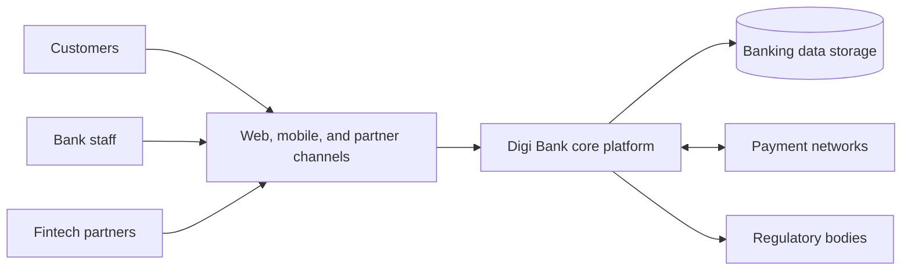
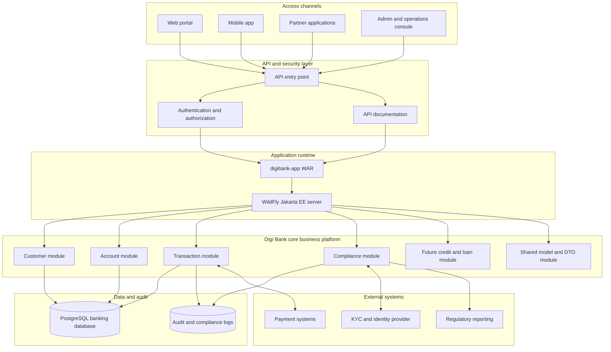

# Digi Bank - Lab 1 Architecture

> UCC 122-1 - Cloud Architecture - Lab 1 
> Architectural foundation for Digi Bank 
> Professional Bachelor's Degree in Cloud Computing - University of the Mountains 
> Supervisor: Eng. Willy Damtchou - June 2026

## 1. Introduction

Digi Bank is a new digital banking platform intended to support online account opening, balance consultation, transfers, payments, credit operations, and regulatory compliance. The system must serve customers through digital channels while giving bank staff, compliance teams, operations teams, and external partners a reliable platform for secure financial services.

This first architecture document defines the initial scope of the system before advanced design decisions such as microservices decomposition, resilience patterns, and cloud scaling. It identifies the stakeholders, essential business functions, architectural constraints, and a first target architecture. The architecture is intentionally high level, but it is aligned with the implementation already produced in Lab 2: a Jakarta EE modular monolith deployed on WildFly, backed by PostgreSQL, and organized around customer, account, transaction, compliance, shared, index, and application assembly modules.

## 2. Business Needs and Stakeholders

Digi Bank needs a central banking system that can support the core activities of a digital bank from the beginning of its launch. The platform must allow customers to open and manage accounts, execute financial operations, consult balances, and interact with payment services. At the same time, it must help the bank satisfy regulatory expectations such as Know Your Customer (KYC), Anti-Money Laundering (AML), traceability of operations, and secure handling of sensitive financial data.

The system is not an isolated web application. It sits at the center of a broader banking ecosystem made of customers, bank employees, external payment networks, fintech partners, regulators, and infrastructure providers.

### Internal Stakeholders

| Stakeholder | Role in Digi Bank |
|---|---|
| Bank administrators | Manage platform configuration, users, operational settings, and supervision tasks. |
| Customer service agents | Assist customers with account issues, onboarding, and transaction questions. |
| Compliance officers | Monitor KYC, AML, suspicious operations, and regulatory reporting requirements. |
| Operations managers | Supervise platform availability, incident response, and service continuity. |
| Technical team | Builds, deploys, monitors, secures, and evolves the banking platform. |
| Management team | Defines banking products, growth strategy, risk appetite, and service-level expectations. |

### External Stakeholders

| Stakeholder | Role in Digi Bank |
|---|---|
| Customers | Use web or mobile channels to open accounts, consult balances, and perform operations. |
| Fintech partners | Integrate through APIs to provide complementary financial services. |
| Payment systems | Process transfers, card payments, interbank exchanges, and settlement flows. |
| Credit and loan partners | Support credit scoring, loan processing, or external verification services. |
| Regulatory bodies | Require compliance evidence, reporting, auditability, and data protection controls. |
| Cloud and infrastructure providers | Provide hosting, networking, storage, monitoring, and managed infrastructure services. |

## 3. Essential Business Functions

The initial Digi Bank architecture must support the following essential functions:

| Function | Description | Current Lab 2 alignment |
|---|---|---|
| Customer management | Create, store, search, and manage customer profiles and identity information. | `digibank-customer` module with REST resource, service, repository, and JPA entity. |
| Account management | Create and consult bank accounts, including account number and balance information. | `digibank-account` module with REST resource, service, repository, and JPA entity. |
| Transaction management | Record deposits, transfers, payments, and other financial operations. | `digibank-transaction` module with REST resource, service, repository, and JPA entity. |
| Payment management | Prepare the system for internal and external payment processing flows. | Represented as part of transaction management and external payment integration. |
| Credit and loan management | Support future credit requests, loan accounts, repayment schedules, and credit decisions. | Identified as a future business module to add after the first operational version. |
| KYC and AML compliance | Validate operations, enforce limits, and support regulatory controls. | `digibank-compliance` module with amount validation and test coverage. |
| API openness | Expose controlled REST APIs for clients, partners, and future channels. | Jakarta REST endpoints under `/api`, with Swagger documentation in the application. |
| Administration and monitoring | Allow technical and operational teams to supervise application behavior. | Supported initially through WildFly, Docker logs, Adminer, and endpoint tests. |

## 4. Architecture Constraints

### Functional Constraints

The system must provide clear access to customer, account, transaction, and compliance operations. It must expose business capabilities through REST APIs so that the web interface, mobile applications, and future partners can interact with the platform through a stable entry point. The system must also be prepared for additional modules such as loans, cards, notifications, reporting, and more advanced fraud detection.

### Non-Functional Constraints

| Constraint | Architectural impact |
|---|---|
| Security | Strong authentication, authorization, encrypted communication, secure database access, and protection of sensitive customer data are required. |
| Availability | Banking services must remain accessible, especially for balance consultation and transaction operations. |
| Traceability | Customer actions, financial operations, compliance decisions, and administrative actions must be auditable. |
| Scalability | The architecture must support growth in users, accounts, transactions, and partner integrations. |
| Regulatory compliance | KYC, AML, data protection, and reporting requirements must shape the design from the beginning. |
| Modularity | Business areas must be separated into clear modules so the system can evolve without becoming disorganized. |
| Maintainability | Code, APIs, database schema, and deployment configuration must remain understandable for a student team and future maintainers. |
| Interoperability | External payment services, fintech partners, and regulatory reporting systems require stable integration interfaces. |
| Data integrity | Financial records must be persisted reliably and protected against inconsistent updates. |

## 5. High-Level Ecosystem View

This ecosystem view shows Digi Bank as the central platform connecting customer channels, bank operations, partner integrations, payment networks, and regulatory reporting. The core platform is responsible for enforcing business rules and protecting the data storage layer.

## 6. First Target Architecture

The first target architecture follows a modular monolithic style. All core business modules are packaged and deployed together as one application, while their responsibilities remain separated. This choice is appropriate for the first phase of Digi Bank because the team needs a coherent, executable platform before introducing the complexity of distributed microservices.

## 7. Structural Choices and Justification

The architecture separates access channels, API entry points, business modules, data storage, security concerns, and external integrations. This separation is important because Digi Bank has both business complexity and regulatory obligations. Customers and partners should interact through APIs, while core banking rules remain inside controlled business modules.

The modular monolith is the right initial structure for Digi Bank because it gives the project a clear domain organization without the operational cost of distributed services. In Lab 2, this is implemented through Maven modules: `digibank-shared`, `digibank-customer`, `digibank-account`, `digibank-transaction`, `digibank-compliance`, `digibank-index`, and `digibank-app`. Each business area has its own Java package, model, service, repository, and REST resource where applicable. The final `digibank-app` module assembles the system into a single deployable WAR.

PostgreSQL is used as the first persistent storage layer because financial systems require durable and structured data. The current implementation persists customers, accounts, and transactions through JPA repositories and a shared persistence unit. This supports data integrity while keeping the persistence model understandable for the current lab phase.

The compliance module is isolated from ordinary transaction processing logic because regulatory rules change frequently and must be tested independently. Even in the first version, the system includes a compliance validation rule and automated tests. This prepares Digi Bank for future KYC, AML, transaction monitoring, reporting, and audit requirements.

The API layer is essential because Digi Bank must support web access now and partner access later. REST endpoints under `/api` create a stable integration surface for customers, administrators, and future fintech partners. Swagger documentation helps make the APIs easier to test, review, and extend.

Security is shown as a dedicated layer in the target architecture even though the current implementation focuses mainly on structural and functional foundations. In a banking system, authentication, authorization, encryption, audit trails, and least-privilege access must be added before production use. Showing security at this stage prevents it from being treated as an afterthought.

External payment systems, KYC providers, and regulatory reporting systems are represented as integration points rather than fully implemented services. This keeps Lab 1 realistic: Digi Bank must be designed for future external connections, but the first lab only needs a clear architectural direction.

## 8. Link Between Lab 1 and Lab 2

Lab 1 provides the reasoning foundation: actors, business functions, constraints, and the first architecture. Lab 2 turns that foundation into an executable modular monolith using Jakarta EE, WildFly, Maven, PostgreSQL, JUnit, and Cucumber.

| Lab 1 architectural concept | Lab 2 implementation evidence |
|---|---|
| Core banking platform | `digibank-app` assembled as a deployable WAR. |
| Business modules | Customer, account, transaction, and compliance Maven modules. |
| Shared model | `digibank-shared` with base entity and response DTO. |
| API layer | JAX-RS resources exposed under `/api`. |
| Persistent data storage | PostgreSQL database and JPA persistence unit `digibankPU`. |
| Compliance control | Compliance service, REST endpoint, JUnit tests, and Cucumber scenarios. |
| Operational deployment | WildFly 33 runtime and Docker Compose environment. |

## 9. Lab 1 Requirement Coverage

| Lab 1 requirement | Covered in this document |
|---|---|
| Identify internal and external actors | Section 2 lists bank staff, technical teams, customers, partners, payment systems, regulators, and infrastructure providers. |
| Describe essential business functions | Section 3 covers customer, account, transaction, payment, credit, compliance, API, and operations functions. |
| Analyze functional and non-functional constraints | Section 4 covers API access, future modules, security, availability, traceability, scalability, compliance, modularity, maintainability, interoperability, and data integrity. |
| Provide a high-level architecture diagram | Sections 5 and 6 provide ecosystem and target architecture diagrams. |
| Justify structural choices | Section 7 explains the modular monolith, API layer, PostgreSQL persistence, compliance isolation, security layer, and external integration points. |
| Link choices to Digi Bank context | Sections 1, 7, and 8 connect the architecture to the existing Digi Bank Lab 2 implementation and future banking needs. |

## 10. Conclusion

The proposed Digi Bank architecture gives the project a coherent starting point. It identifies the main actors, covers the minimum banking functions, accounts for major financial-system constraints, and proposes a modular structure that can evolve over time.

The architecture is intentionally simple for the first phase: a secure API-facing modular monolith with a PostgreSQL database and clear business modules. This structure supports the immediate educational objective of building an executable system while keeping a path open toward stronger security, deeper compliance, payment integration, loan management, observability, and eventual microservices decomposition if the platform grows enough to justify it.
