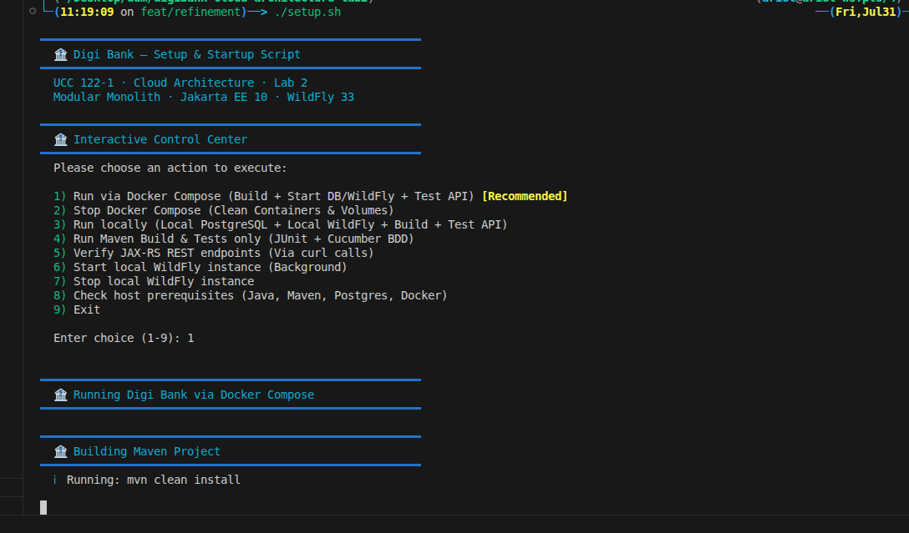
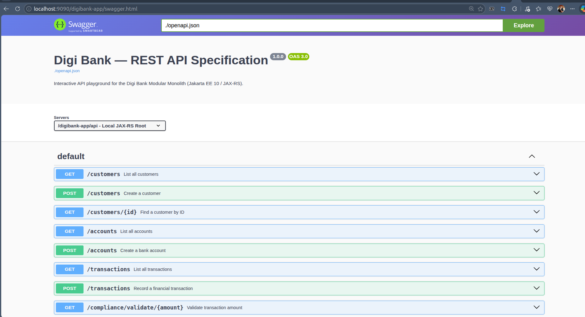
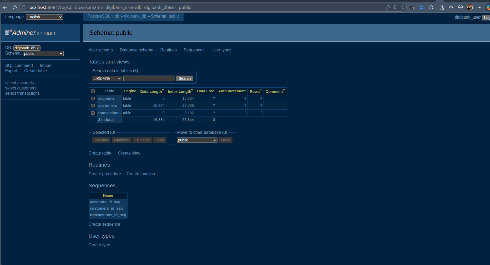
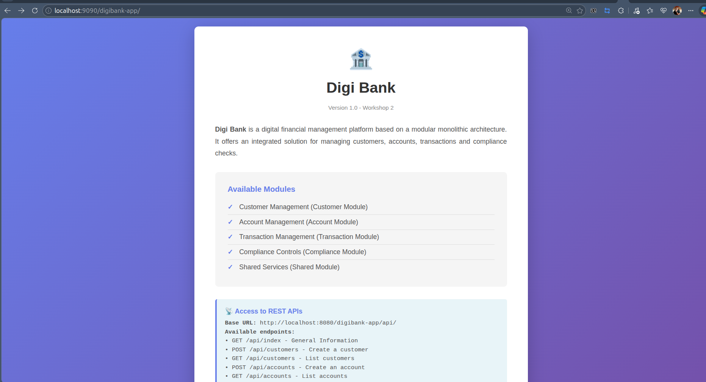
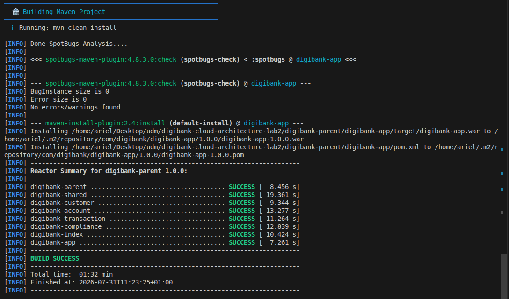

# DigiBank Project Startup and Verification Guide

This guide describes how to run and verify the DigiBank modular monolith application using the provided setup script.

---

## 1. Prerequisites
Ensure you have the following installed on your system:
- Java 17+
- Maven 3.8+
- Docker & Docker Compose
- PostgreSQL (if running locally without Docker)

---

## 2. Launching the Project

To start the project, run the `setup.sh` script located at the root of the repository:

```bash
chmod +x setup.sh
./setup.sh
```

### The Interactive Control Center
Running the script without arguments opens the interactive menu:
1. **Run via Docker Compose (Option 1):** Builds the application on the host and starts the services inside Docker containers. **(Recommended)**
2. **Stop Docker Compose (Option 2):** Stops the containers and clears volumes.
3. **Run Locally (Option 3):** Downloads, configures, and deploys WildFly on your host machine alongside a local PostgreSQL instance.

Choose **Option 1** to start the application with Docker Compose.

---

### Screenshot 1: Setup Script Running
Here is the terminal output of `./setup.sh` successfully running Option 1 and deploying the services:



---

## 3. Accessing the Application Services

Once the application is deployed and responsive, you can access the following interfaces:

| Service | URL | Description |
|---|---|---|
| **API Base URL** | [http://localhost:9090/digibank-app/api/](http://localhost:9090/digibank-app/api/) | Root path for REST resources |
| **Swagger UI** | [http://localhost:9090/digibank-app/swagger.html](http://localhost:9090/digibank-app/swagger.html) | OpenAPI interactive console for testing APIs |
| **Adminer DB Tool** | [http://localhost:8082](http://localhost:8082) | Database management interface |

### Database Connection Details (Adminer)
- **System:** PostgreSQL
- **Server:** `db`
- **Username:** `digibank_user`
- **Password:** `digibank_pwd`
- **Database:** `digibank_db`

---

### Screenshot 2: Swagger UI Console
Here is the Swagger UI interface loaded in the browser:



---

### Screenshot 3: Adminer DB Interface
Here is the Adminer database tool logged into the database:



---

### Screenshot 4: DigiBank Application UI (Landing Page)
Here is the default landing web portal page of the application:



---

## 4. How to Verify Everything is Working

### Run Automated Unit and Integration Tests
You can run all Cucumber BDD and JUnit unit tests by executing:
```bash
./setup.sh test
```

### Run REST Endpoint Validation Tests
You can run automated curl validations against all REST resources by running:
```bash
./setup.sh endpoints
```
All tests should return `HTTP 200` or `HTTP 201` responses.

---

### Screenshot 5: Test and Verification Output
Here is the terminal output showing the results of the automated REST endpoint tests:


